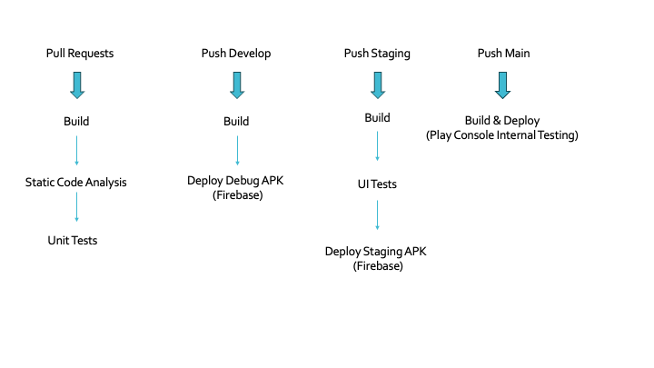

# Android CI/CD Pipelines

This repository contains a sample project demonstrating **Continuous Integration (CI)** and **Continuous Delivery (CD)** pipelines for Android using **Fastlane** and **GitHub Actions**.

---

## Branching Strategy

This project follows the **Gitflow** workflow for managing Git branches:

- **Main**: Production branch.
- **Develop**: Development branch.
- **Release**: Staging (pre-production) branch.
- **Feature**: Individual branches for feature development.

---

## Pipelines Overview

Below is a diagram showing the four main pipelines, with further details for each one.

### 1. Pull Requests
- **Trigger Event**: Activated on the creation of any pull request from any branch.
- **Jobs**:
  - **`build`**: Builds the project.
  - **`static_code_analysis`**: Performs code quality checks using Android Lint and KtLint.
  - **`unit_tests`**: Executes all unit tests.

### 2. Deploy Debug
- **Trigger Event**: Activated on push to the `develop` branch.
- **Jobs**:
  - **`build`**: Builds the project.
  - **`deploy`**: Deploys the debug build using Fastlane.

### 3. Deploy Staging
- **Trigger Event**: Activated on push to the `release` branch.
- **Jobs**:
  - **`build`**: Builds the staging version of the project and signs the APK.
  - **`ui_tests`**: Runs UI tests using the Maestro UI testing framework.
  - **`deploy`**: Deploys the signed APK to Firebase App Distribution.

### 4. Deploy Release
- **Trigger Event**: Activated on push to the `main` branch, when the staging version is tested and ready for production.
- **Steps**:
  - Builds a signed Android App Bundle (AAB).
  - Deploys the AAB to the Google Play Console using Fastlane.

---

## App Version Code Calculation

The app version code is calculated using the following formula:
1. Multiply the **major part** of the app version (`major`, `minor`, `patch`) by **10,000**.
2. Add the **build number** of the specific pipeline to the result.

This ensures that each build has a unique and incrementing version code.
